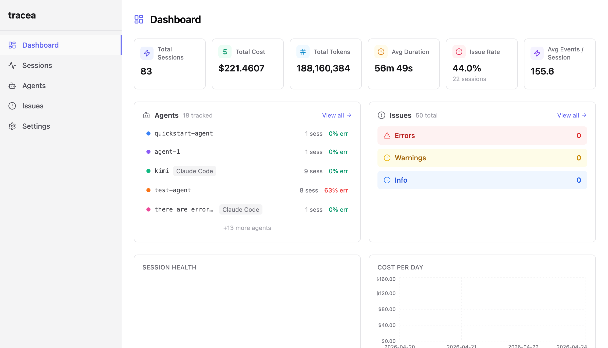
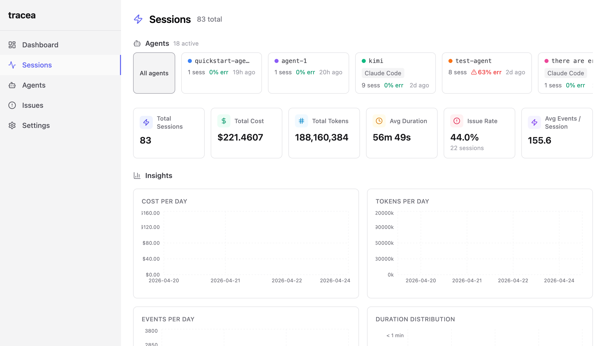
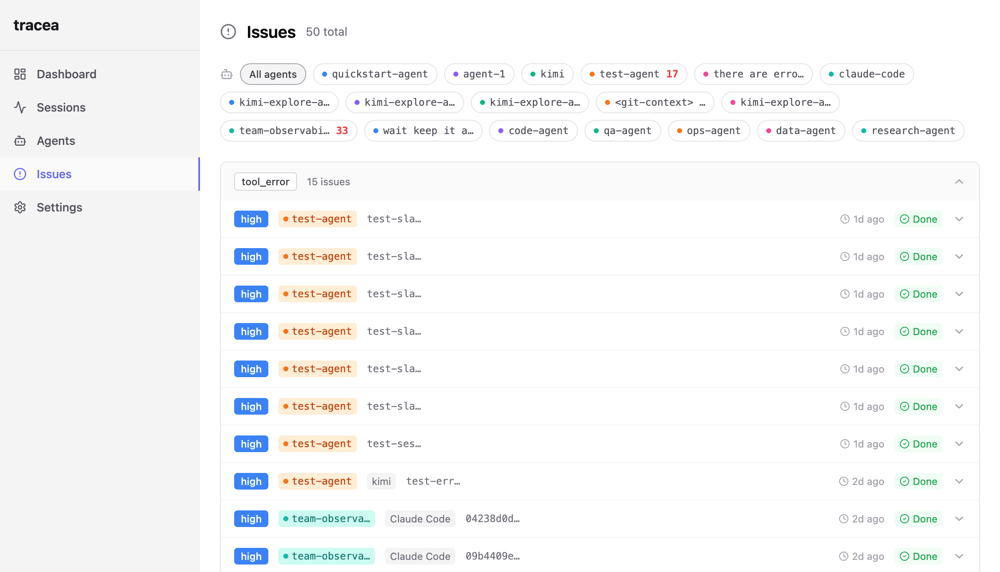

<div align="center">

# 🔭 tracea

**Self-hosted AI agent observability. Own your data.**

Trace LLM sessions, detect anomalies, analyze root causes, and route alerts — all from a single dashboard.

[](https://www.python.org/downloads/)
[](LICENSE)
[](#development)
[](https://www.docker.com/)

</div>

---

## 📸 Screenshots

| Overview | Sessions | Issues |
|----------|----------|--------|
|  |  |  |

---

## ✨ Why tracea?

Most AI observability tools are **cloud-hosted SaaS** that ship your agent data to someone else's servers. tracea is different:

| | Cloud SaaS | **tracea** |
|---|---|---|
| **Data ownership** | ❌ Their servers | ✅ **Your server** |
| **Framework lock-in** | ❌ Vendor SDKs | ✅ **Transport patching** — works with any framework |
| **Rules** | ❌ Hidden/black-box | ✅ **YAML rules** — inspectable, version-controlled |
| **Cost** | ❌ Per-seat / per-event pricing | ✅ **Free & open source** |
| **Alerting** | ❌ Limited integrations | ✅ **Slack + generic webhooks** — route anywhere |

---

## 🚀 Quick Start

### Docker (recommended)

```bash
git clone https://github.com/darshannere/tracea.git
cd tracea
docker-compose up --build
```

- Server: `http://localhost:8080`
- Dashboard: `http://localhost:5173`
- API key: printed in logs + written to `./data/api_key.txt`

### Local Development

**1. Backend**

```bash
pip install -e "."

cp .env.example .env
mkdir -p data
cp tracea/server/detection/defaults/detection_rules.yaml data/
cp tracea/server/alerts.yaml data/

export $(grep -v '^#' .env | xargs)
uvicorn tracea.server.main:app --host 0.0.0.0 --port 8080 --workers 1
```

**2. Dashboard (separate terminal)**

```bash
cd dashboard
npm install
npm run dev
```

Open `http://localhost:5173` and paste your API key.

**3. Send an event**

```bash
API_KEY=$(cat data/api_key.txt)

curl -X POST http://localhost:8080/api/v1/events \
  -H "Authorization: Bearer $API_KEY" \
  -H "Content-Type: application/json" \
  -d '{
    "events": [{
      "event_id": "evt-001",
      "session_id": "sess-001",
      "agent_id": "my-agent",
      "sequence": 1,
      "timestamp": "'$(date -u +%Y-%m-%dT%H:%M:%SZ)'",
      "type": "chat.completion",
      "provider": "openai",
      "model": "gpt-4o",
      "role": "user",
      "content": "Hello, world!",
      "duration_ms": 120,
      "tokens_used": {"input": 10, "output": 5, "total": 15},
      "cost_usd": 0.0003
    }]
  }'
```

Refresh the dashboard — your session appears instantly.

**4. Connect your agents**

Install the Python SDK and run the setup wizard:

```bash
pip install tracea
tracea init
```

This creates `~/.tracea/config.json` with your server URL, API key, and user ID so all plugins and SDKs share the same configuration.

See [tracea-plugins/](tracea-plugins/) for per-agent hook installation.

---

## 🏗️ Architecture

```
┌─────────────────────────────────────────────────────────────┐
│  tracea Server (FastAPI + SQLite WAL)      port 8080       │
│  ├── Ingest API  →  Batch writer  →  SQLite                │
│  ├── Detection Engine  →  YAML rules  →  Issues table      │
│  ├── RCA Worker  →  OpenAI / Anthropic / Ollama            │
│  └── Alert Dispatcher  →  Slack / Webhooks                 │
└─────────────────────────────────────────────────────────────┘
                              ▲
                              │ HTTP
┌─────────────────────────────────────────────────────────────┐
│  tracea Dashboard (React 18 + Vite)        port 5173       │
│  ├── Sessions, Events, Issues, Agents                      │
│  ├── Cost / Token / Duration charts (Recharts)             │
│  └── Settings editor for rules & alerts                    │
└─────────────────────────────────────────────────────────────┘
                              ▲
                              │ SDK / MCP / Hooks
┌─────────────────────────────────────────────────────────────┐
│  Your Agents                                                │
│  ├── Python SDK (httpx patch) → OpenAI, Anthropic, Azure   │
│  ├── tracea-mcp (stdio JSON-RPC) → Claude Code, Cursor     │
│  └── Native hooks → Claude Code, Gemini CLI, Kimi, OpenCode│
└─────────────────────────────────────────────────────────────┘
```

---

## 🧩 Features

### 🔍 Session Tracking
Automatically trace LLM calls, tool executions, errors, and session lifecycle. Works with any framework through transport-level interception.

### 📊 Real-time Dashboard
React dashboard with cost trends, token usage, duration distribution, session health, and agent breakdowns.

### 🚨 Issue Detection
YAML-configurable detection rules for:
- Tool errors & task failures
- High cost & high latency
- Rate limits & repeated calls
- Infinite loops & empty responses

Rules hot-reload on save — no server restart needed.

### 🧠 AI-Powered RCA
Root cause analysis powered by LLMs:
- **OpenAI** — GPT-4o, etc.
- **Anthropic** — Claude Sonnet, etc.
- **Ollama** — local, free, private

Disabled by default. Cloud backends show a warning banner.

### 📡 Alert Routing
Route issues to Slack or generic HTTP webhooks:
- Per-destination rate limiting
- Deduplication (60s window)
- Exponential backoff retry (3 attempts)
- Dead-letter table for permanent failures

---

## 🔌 Agent Integration

| Agent | Integration | Auto-captures | Install |
|-------|-------------|---------------|---------|
| **Claude Code** | Native hooks | ✅ All tools | `tracea-hook.sh` + `settings.json` |
| **Gemini CLI** | Native hooks | ✅ All tools | `tracea-hook.py` + `settings.json` |
| **Kimi CLI** | Native hooks | ✅ All tools | `tracea-hook.py` + `config.toml` |
| **OpenCode** | Plugin system | ✅ All tools | `tracea-plugin.ts` → `~/.opencode/plugins/` |
| **OpenClaw** | Plugin hooks | ✅ All tools | `openclaw.json` |
| **Cursor** | MCP | ⚠️ Explicit calls | `tracea-mcp` |
| **Cline** | MCP | ⚠️ Explicit calls | `tracea-mcp` |
| **Zed** | MCP | ⚠️ Explicit calls | `tracea-mcp` |
| **Python scripts** | SDK | ✅ All LLM calls | `pip install tracea` |

See [tracea-plugins/](tracea-plugins/) for full setup guides.

---

## ⚙️ Configuration

Copy the example env file and adjust:

```bash
cp .env.example .env
```

| Variable | Description | Default |
|----------|-------------|---------|
| `TRACEA_DB_PATH` | SQLite database path | `./data/tracea.db` |
| `TRACEA_API_KEY_FILE` | API key read/write path | `./data/api_key.txt` |
| `TRACEA_DATA_DIR` | Config directory (rules, alerts) | `./data` |
| `TRACEA_RULES_PATH` | Detection rules YAML | `./data/detection_rules.yaml` |
| `TRACEA_ALERTS_PATH` | Alerts routing YAML | `./data/alerts.yaml` |
| `TRACEA_RCA_BACKEND` | `disabled` / `openai` / `anthropic` / `ollama` | `disabled` |
| `TRACEA_AUTH_MODE` | `disabled` or `api_key` | `disabled` |
| `TRACEA_USER_ID` | Team member ID for multi-user dashboards | — |
| `TRACEA_DEV_MODE` | `1` = bypass auth (local only) | — |

### Dev Mode

For zero-friction local development:

```bash
TRACEA_DEV_MODE=1 uvicorn tracea.server.main:app --host 0.0.0.0 --port 8080
```

**Never use in production.**

---

## 🛠️ Development

```bash
# Backend tests
pytest tests/

# SDK tests
cd sdk-python && pytest

# MCP tests
cd tracea-mcp && pytest

# Dashboard
cd dashboard && npm run build
```

---

## 📦 Project Structure

```
tracea/
├── tracea/                  # FastAPI backend
│   ├── server/
│   │   ├── main.py         # App entry point
│   │   ├── db.py           # SQLite + WAL
│   │   ├── routes/         # API routes
│   │   ├── detection/      # Rule engine + watcher
│   │   ├── rca/            # RCA worker + LLM backends
│   │   └── alerts/         # Alert dispatcher
│   └── server/migrations/  # Schema migrations
├── dashboard/              # React 18 + Vite dashboard
├── sdk-python/             # Python SDK
├── tracea-mcp/             # MCP server
├── tracea-plugins/         # Agent hook plugins
├── data/                   # SQLite + config (runtime)
├── docker-compose.yml
└── .env.example
```

---

## 📝 License

MIT — see [LICENSE](LICENSE) for details.
